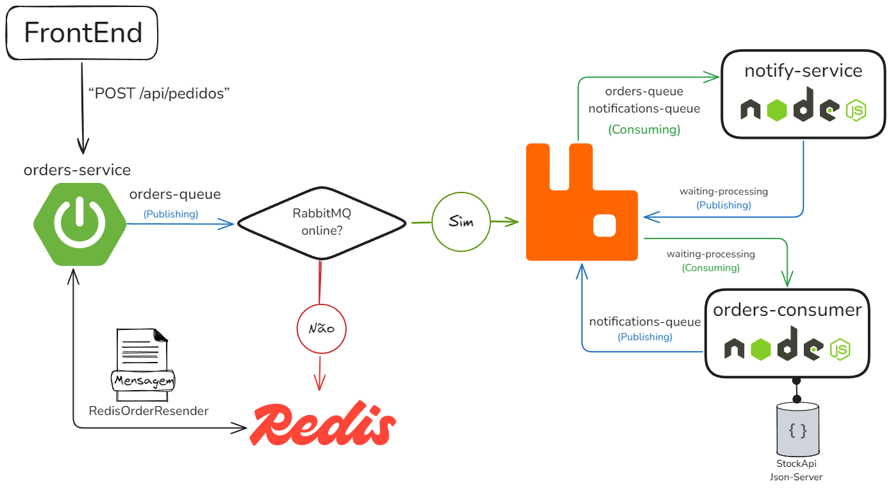
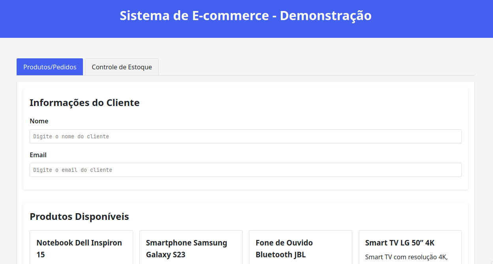
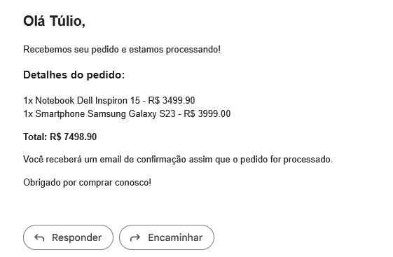

# Sistema de Pedidos Resiliente com Spring Boot, RabbitMQ, Redis e Node.js

Este projeto é uma demonstração de um sistema de pedidos resiliente utilizando **Spring Boot**, **RabbitMQ**, **Redis** e **Node.js**, com capacidade de tolerância a falhas e recuperação automática.

A arquitetura foi projetada para garantir **entregabilidade de mensagens**, **persistência**, e **comunicação entre serviços de forma assíncrona**.

Este projeto foi desenvolvido por:

- [github.com/tuliobaruk](https://github.com/tuliobaruk)
- [github.com/thiagojorgelins](https://github.com/thiagojorgelins)

---

## Tecnologias Utilizadas

[](#)
[](#)
[](#)

[](#)
[](#)
[](#)
[](#)

---

## Diagrama de Arquitetura

[](./docs/Arquitetura.png)

---

## Decisões Arquiteturais e Garantias de Resiliência

A arquitetura deste sistema foi projetada para oferecer resiliência, confiabilidade e continuidade no processamento de pedidos, mesmo diante de falhas temporárias.

Em situações em que o RabbitMQ esteja temporariamente offline ou indisponível, o `orders-service` detecta imediatamente a exceção e grava o pedido em um buffer no Redis, evitando qualquer erro perceptível para o cliente e garantindo que nenhuma solicitação seja perdida. Um job agendado (`@Scheduled`) varre periodicamente esse buffer e reenvia todas as mensagens pendentes assim que o broker volta a responder, restabelecendo o fluxo normal sem intervenção manual.

Além disso, mantemos o isolamento entre os componentes de envio de e-mails e processamento de pedidos para que o cliente receba sempre uma confirmação inicial de registro do pedido. Mesmo que o `orders-consumer` esteja fora do ar no momento, o `notify-service` consome a mensagem diretamente da fila principal do RabbitMQ e dispara imediatamente o e-mail de “Pedido Recebido”. Só então a mensagem segue para a fila de processamento posterior (`waiting-processing`), aguardando a geração do PDF e o envio do e-mail de confirmação definitiva assim que o consumer retornar.

Em cenários em que o próprio `notify-service` fique indisponível, todas as mensagens continuam armazenadas de forma persistente, seja no RabbitMQ (com filas duráveis) ou, em último caso, no Redis via fallback do `orders-service`. Assim que o serviço de notificações é restaurado, ele retoma automaticamente o consumo das mensagens enfileiradas e completa o envio de e-mails, assegurando a entregabilidade eventual.

Com essa abordagem de mensageria assíncrona acompanhada de mecanismos de fallback e reenvio automático, garantimos um padrão de arquitetura distribuída resiliente, onde nenhuma etapa crítica do processamento de pedidos fica sujeita à perda de dados mesmo diante de falhas momentâneas dos serviços.

---

## Pré-requisitos

- **Docker**
- **Docker Compose**

---

## Estrutura do Projeto

```
.
├── docker-compose.yml
├── frontend/              # Página HTML para interação com a API
├── notify-service/        # Envia e-mails com Nodemailer
├── orders-consumer/       # Processa pedidos e gera PDFs com PDFKit
├── orders-service/        # API Spring Boot para registrar pedidos
├── stock-api/             # JSON Server simulando banco de dados
├── README.md
└── docs/                  # Imagens utilizadas no README.md
```

---

## Funcionamento

### 1. Utilizando o frontend simples

No projeto dessenvolvemos uma única página HTML que serve como interface para simular o envio de pedidos de forma rápida e prática, conectando-se à API REST da aplicação.

Basta acessar:

```bash
http://localhost:80
```



### 2. Envio de Pedido via requisição para API

Endpoint:

```
POST http://localhost:8080/api/pedidos
```

Payload:

```json
{
  "cliente": {
    "nome": "Seu nome",
    "email": "seu@email.com"
  },
  "itens": [
    {
      "idProduto": "1",
      "nome": "Notebook Dell Inspiron 15",
      "quantidade": 6,
      "precoUnitario": 3499.9
    },
    {
      "idProduto": "2",
      "nome": "Smartphone Samsung Galaxy S23",
      "quantidade": 1,
      "precoUnitario": 3999.0
    }
  ]
}
```

Resposta:

```json
{
  "idPedido": "UUID",
  "dataCriacao": "data e hora",
  "cliente": {...},
  "itens": [...],
  "valorTotal": 24998.4,
  "status": "pendente"
}
```

E, após a mensagem chegar ao `notify-service`, se o arquivo `.env` estiver configurado corretamente conforme explicado acima, o e-mail de confirmação do pedido será enviado para o endereço de e-mail do cliente da requisição.

## Fluxo mais detalhado do processamento

1. **API envia pedido à `orders-exchange` → `orders-queue`**
2. **Notify Service** escuta a `orders-queue` e:
   - Envia e-mail: “Pedido Recebido”
   - Encaminha o pedido para a fila `waiting-processing`
3. **Orders Consumer** escuta a `waiting-processing` e:
   - Gera PDF com `pdfkit`
   - Retorna notificação ao `notify-service`
4. **Notify Service** envia e-mail: “Pedido Confirmado” com PDF em anexo

---

# Rodando o projeto

## Subindo com Docker Compose

Com Docker e Docker Compose instalados, execute o comando abaixo para subir todos os serviços:

**(Antes disso é necessária a criação do .env como exemplificado na seção abaixo)**

```bash
docker-compose up --build -d
```

---

## Configuração de E-mail no Notify Service

O `notify-service` usa o **Nodemailer** para envio de e-mails. É necessário criar um arquivo `.env` na pasta `/notify-service` com as credenciais do remetente:

```env
USER_GMAIL="seu_email@gmail.com"
PASSWORD_GMAIL="sua_senha_de_aplicativo"
```

> 💡 **Importante:** A senha do Gmail deve ser uma **senha de aplicativo**, que pode ser gerada [neste link](https://myaccount.google.com/apppasswords) (com a autenticação em dois fatores ativada na conta).

---

## Como implementamos Fallback de Envio utilizando Redis

Ao a API tenta enviar o pedido diretamente para o **RabbitMQ**:

```java
OrderService.java:

try {
    rabbitTemplate.convertAndSend(
        RabbitMQConfig.EXCHANGE,
        RabbitMQConfig.ROUTING_KEY,
        order
    );
} catch (AmqpException e) {
    redisBuffer.save(order);
    System.err.println("RabbitMQ está offline. Pedido salvo no Redis.");
}
```

Caso não consiga conexão e levante uma exception, o **OrderService** irá salvar a mensagem no redis e então um `@Scheduled` job tenta reenviar os pedidos armazenados a cada 10 segundos:

```java
RedisOrderResender.java:

@Scheduled(fixedRate = 10000)
public void resendBufferedOrders() {
    Order order;
    while ((order = redisBuffer.getNextOrder()) != null) {
        try {
            rabbitTemplate.convertAndSend(...);
        } catch (Exception e) {
            redisBuffer.save(order);
            break;
        }
    }
}
```

É uma solução **eficiente em termos de uso de memória** e garante que, caso ocorra alguma **falha de conexão entre o `orders-service` e o broker de mensagens**, **nenhum pedido seja perdido**. Essa falha **não impacta a experiência do usuário final**, e o processo segue normalmente sem interrupções.

Em um **cenário real de produção**, o mais recomendado seria **trabalhar com replicação e escalar o RabbitMQ** para garantir **alta disponibilidade** e **tolerância a falhas** de forma mais robusta. No entanto, essa abordagem **serviu como um ótimo aprendizado**, mostrando que é possível implementar **uma camada de contingência simples** para lidar com **falhas temporárias de comunicação entre serviços**.

---

## Exemplo dos emails enviados por `notify-service`

**Email de pedido recebido:**



**Email de pedido confirmado:**


